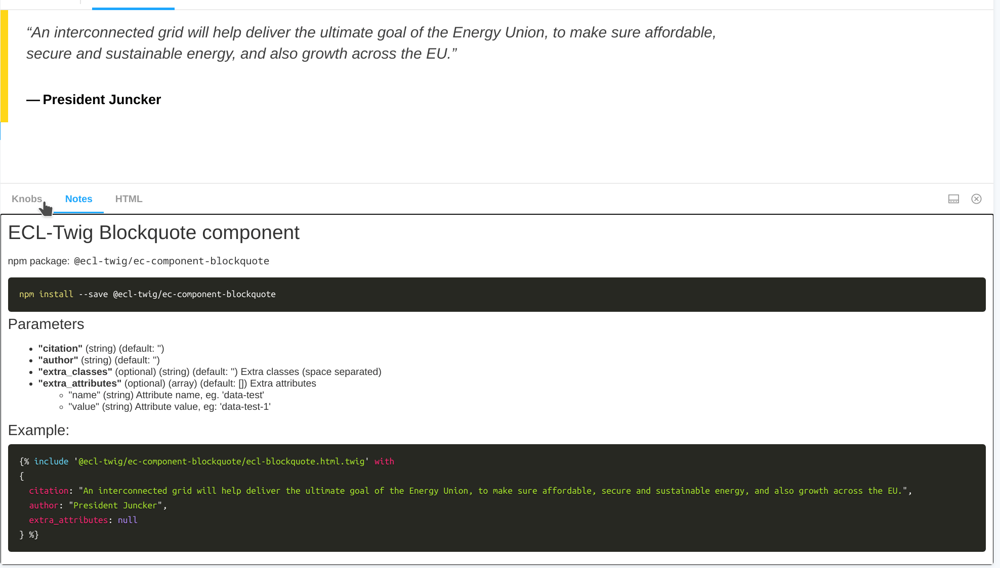

# ECL-Twig Library

The ECL-Twig is a library of [twig](https://twig.symfony.com/) templates, implementing the Europa Component Library (ECL) vanilla (html/css/js) components.
ECL is a library of components applicable to all European Commission websites (hosted under europa.eu and ec.europa.eu domains), the library contains all the available components to build your website.

For information on how to use the ECL library please refer to the information available in the [ECL docs](https://github.com/ec-europa/europa-component-library/blob/v2-dev/docs/README.md)

The twig implementation of the ECL components is mainly meant to serve [Drupal 8](http://drupal.org) applications, therefore the version of twig in use is `1.x`.

## EC/EU

ECL is a library used both for EC (European Commission) and EU (European Union) websites, it comes with two sets of distributes resources (css, js) for the two visual identities.

Although they may differ in style, in the current v2 version, the HTML markup is the same. ECL-Twig is shipping one single template that can be used while working on both EC and EU websites. Templates are aware of the system (ec/eu) in use because they don't need to be.

## The ECL-Twig website(s)

ECL-Twig is capable of rendering twig templates using both a javascript implementation of twig ([twing](https://github.com/NightlyCommit/twing)) and [twig](https://twig.symfony.com/) as a php package.
Two different instances of [Storybook](http://storybookjs.org) are distributed:

- [ECL-Twig JS](https://ecl-twig-js.netlify.com) - interactive (renders the twig templates)
- [ECL-Twig PHP](https://ecl-twig-php.netlify.com) - static (uses html files rendered through twig php)

The two versions EC/EU are available as a separated storybook instance in the two websites, the first page offers a simple choice between the two and a switcher is available in storybook to easily move between the two.

### Browser support

Unfortunately the ECL-Twig websites are not usable with Internet Explorer, in any version.

Also the support to Edge is limited to the latest releases.

## ECL-Twig components

The components released by ECL-Twig are node packages containing at least one `.html.twig` file (the component templates) and a `README.md` file with the documentation of the data structure supported by the component and an example of an include code for the template.

The [ECL-Twig JS](https://ecl-twig-js.netlify.com) website can be used to customize a component through "knobs". (interactive fields) Such tweaks are reflected in the twig include code example visible in the `notes` tab. The website is also presenting a demo of the `ECL compliance` tool available in the library, in the `validation` tab.

  

## Documentation

Read the technical documentation [on GitHub](docs).

## Quick start

The components provided by the ECL-Twig library are available [on npm](https://www.npmjs.com/package/@ecl-twig/ec-components).

- fetch the templates with npm or yarn, e.g. `npm install @ecl-twig/ec-components` or `yarn add @ecl/ecl-twig/ec-components`
- include the templates in your application, you will need a `twig loader` capable of identifying the templates using their namespace `ecl-twig`, use the available documentation together with the include code example provided in the `README.md` file of each component.

## Need help?

Please contact [COMM Europa Management](mailto:Europamanagement@ec.europa.eu) for support on using this resource for a European Commission or a European Union website.
